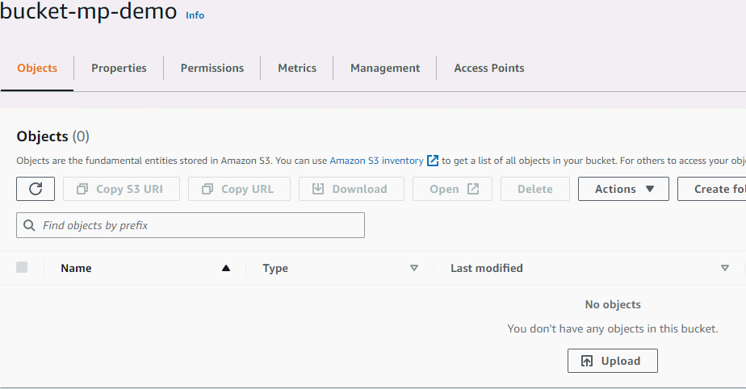

# Bonus 1

This is the extended version of the Python script that processes a folder of video files and uploads them to the bucket. 

## Installation

The scripts makes use of the Boto3 library which can be installed by running:

```bash
pip install -r requirements.txt 
```

Additionally, the script makes use of the **ffmpeg** packaged to do the processing of the video. So, it's important that the it's installed on your local machine. 
You can follow the instruction depending on your OS on their [website](https://ffmpeg.org/download.html)

A sample folder of videos is also provided.

## Usage

On **Windows**:

```bash
python script.py "input_folder_path" "output_folder_path" "s3_bucket" 
```

On **Linux**:

```bash
python3 script.py "input_folder_path" "output_folder_path" "s3_bucket" 
```

## Demo 

