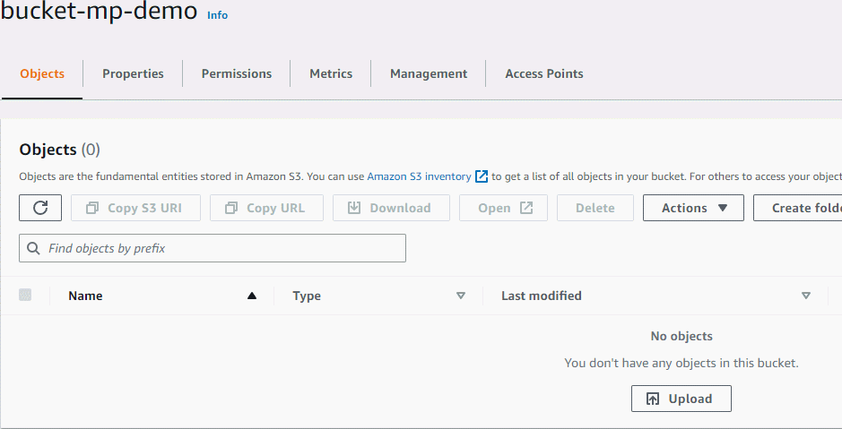

# Bonus 2

This is the extended version of the assignment. An AWS Lambda function is implemented which is triggered by an uppload of a **.mp4** file to the **/trigger** directory. (Directories don't actually exist within S3 buckets. The entire file structure is actually just one flat single-level container of files but let's call it directory for convenience). The function uses the **ffmpeg** to create a thubmnail and then uploads it to the **/thumbnails** directory. The ffmpeg binary is packaged and deoplyed with the function source code. However, this approach may not be the best way of doing since functions enviroment could be constrained. Alternative approahes could be to attach the ffmpeg as a layer to the function. However, in our case the media processing is not very heavy, unless the video file we're downloading in the enviroment is bigger than the internal storage. 

Additionally, the Lambda function must have the proper permissions to be able to execute the task.

The yaml file regarding the configuration of the function is also provided.

## Demo 

