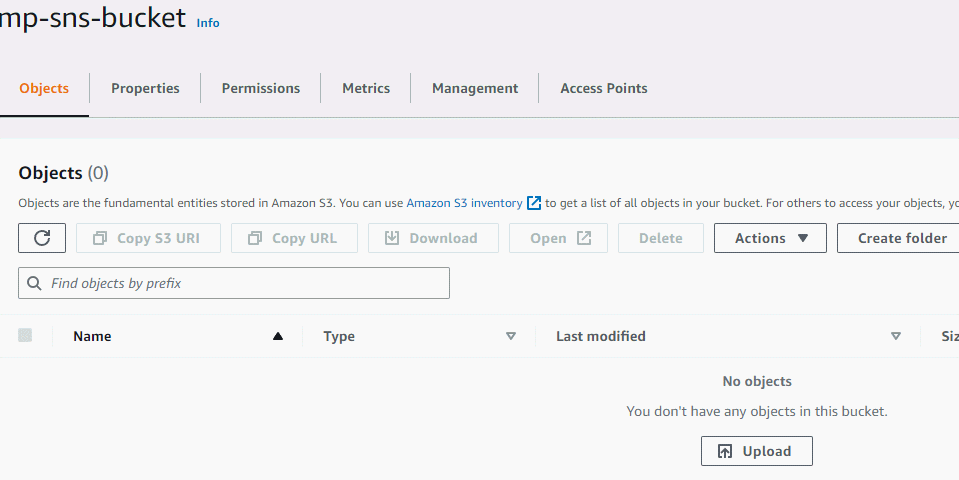

# Bonus 3

This is the extended version of the assignment. S3 events are sent to a SNS topic which then triggers a Lambda function that is subscribed to that topic. Additionally, for confirming and actually seing the message published by the lambda function on the topic we can subscribe a SQS queue to the SNS topic. For testing purposes, a different bucket and lambda functions were created. 

The yaml file regarding the configuration of the function is also provided.

## Demo 

