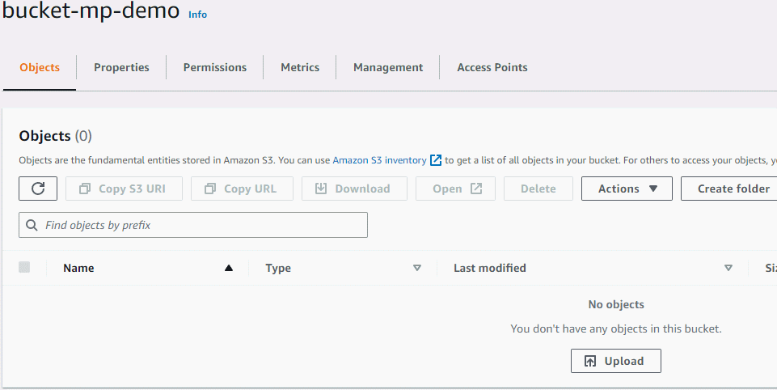

# Bonus 4

This is the extended version of the Python script. The script receives three file paths, the input video file path and two yaml configuration files. The configuration files are an example of an S3 CloudFormation configuration format where the BucketNames are defined. additionally, the script saves the outputs in the directory of the input file. A logging functionality is added that logs the execution time of:

* Reading the file
* Processing video function
* Creating  thumbnail function
* upload to S3

The logs are then printed at the end execution of the script.

The example yaml files are also provided.

## Installation

The scripts makes use of the Boto3 and pyyaml libraries which can be installed by running:

```bash
pip install -r requirements.txt 
```

Additionally, the script makes use of the **ffmpeg** packaged to do the processing of the video. So, it's important that it's installed on your local machine. 
You can follow the instruction depending on your OS on their [website](https://ffmpeg.org/download.html)

A sample folder of videos is also provided.

## Usage

On **Windows**:

```bash
python script.py "input_folder_path" "config1_yaml_path" "config2_yaml_path" 
```

On **Linux**:

```bash
python3 script.py "input_folder_path" "config1_yaml_path" "config2_yaml_path" 
```

## Demo 

