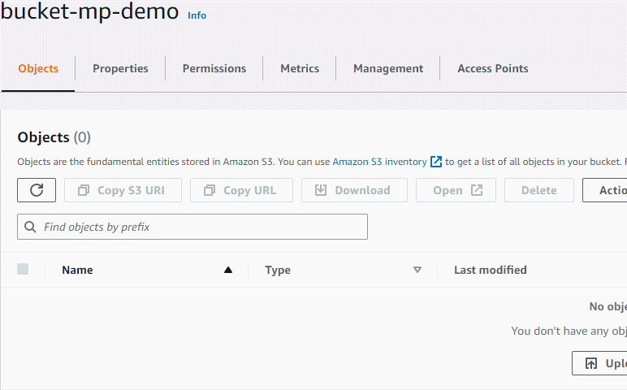

# Main Challenge

This is a Python script that processes a single video file and uploads it to the bucket

## Installation

The scripts makes use of the Boto3 library which can be installed by running:

```bash
pip install -r requirements.txt 
```

Additionally, the script makes use of the **ffmpeg** packaged to do the processing of the video. So, it's important that the it's installed on your local machine. 
You can follow the instruction depending on your OS on their [website](https://ffmpeg.org/download.html). It's worth mentioning that we're spawning a child process to do this for us and we have less control over things that someone else runs for us, such as a subprocess in this case. Another approach would be to implement an alternative with a library that can do this internally within python instead of a system call such as **moviepy**.

A sample video file is also provided.

## Usage

On **Windows**:

```bash
python script.py "input_file_path" "output_file_path" "s3_bucket" "object_key"
```

On **Linux**:

```bash
python3 script.py "input_file_path" "output_file_path" "s3_bucket" "object_key"
```

## Demo 

